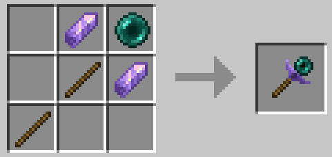
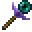
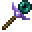

# Summoning Wand 召唤魔杖

语言: **简体中文** | [English](README.md)

Modrinth: [Summoning Wand](https://modrinth.com/mod/summoningwand)

<div align="center">

</div>

本模组添加了一种可以将绑定的实体传送到你的周围的魔杖，工作原理与`/tp`命令相似。<br/>

* **适合人群**：懒得费力搬运实体或手打`/tp`命令的休闲玩家
* **适用场景**：召唤坐骑/载具、运输生物、……
* **开发环境**：
  * Minecraft版本：1.20.1
  * Forge MDK版本：47.4.0
* **支持版本**：

<div align="center">

| Minecraft | Forge | NeoForge |
|:---------:|:-----:|:--------:|
|  1.20.1   | 47.x* |   理论支持   |
</div>

\* 已在 47.4.0 和 47.3.0 测试，理论上支持全版本

## 特性
[//]: # (介绍视频：[比利♂比利]&#40;&#41;)

### 物品信息
* 名称：召唤魔杖
* ID：`summoningwand:summoning_wand`
* 创造标签页：工具与用品
* 耐久：132
* 合成配方：
<div align="center">

</div>

### 使用方法
* **绑定实体**：指定的手（默认为**副手**）持有召唤魔杖时，右击交互实体，可将实体绑定到魔杖；
  * 未绑定实体的魔杖纹理为 <span></span> ；绑定实体后魔杖纹理变为 <span></span> ，名称变为黄色并在括号内注明被绑定实体的名称或类型；
  * 魔杖会保存实体 UUID ，因此退出世界重新进入不会导致绑定失效；
  * 默认可绑定的实体类型：所有能够被右键交互的实体，如生物（包括玩家）、载具（矿车、船等）、下落的方块等；
* **传送实体**：指定的手（默认为**主手**）持有召唤魔杖时，右击交互方块，可将被绑定的实体传送到目标位置;
  * 传送机制与`/tp`命令基本一致，但乘客也会被一同传送；按住`Shift`可阻止乘客被传送；
  * 未加载区块内的实体无法被传送；
  * 目标位置可能为被交互方块所在格或与它被交互的面相邻的那一格，具体判断逻辑见[`SummoningWandItem.java`](src/main/java/xyc/summoningwand/SummoningWandItem.java)；
  * 选择目标位置时**不会**检查是否存在窒息、摔落或其他伤害（如火和岩浆）风险，因此传送生物时请注意安全；
  * 默认可作为目标位置的方块类型：无碰撞箱方块（花、火把、液体等）、部分不完整方块（取决于配置，具体判断逻辑见[`SummoningWandItem.java`](src/main/java/xyc/summoningwand/SummoningWandItem.java)）；
* **解除绑定**：将召唤魔杖放入合成网格合成，可清除绑定信息（**会失去附魔**）；
* **信息提示**：鼠标悬浮于物品栏中的召唤魔杖物品上时：
  * 如果按下`Shift`，信息框中会显示简略的使用方法；
  * 如果已绑定实体，信息框中会显示魔杖拥有者的名称，以及绑定的实体名称或类型；
* **命令**：使用`/summoningwand`命令查询或**手动更新配置**，以替代 Forge 自带的（可靠性十分堪忧）的配置自动热更新功能；

  ```
  /summoningwand config <allClients|client|common> <GET|REFRESH>
  ```

  * `<allClients|client|common>`
    * `allClients`：管理所有玩家的客户端配置（需要权限等级`4`）
    * `client`：管理自己的客户端配置
    * `common`：管理通用配置（更新需要权限等级`4`）
  * `<GET|REFRESH>`
    * `GET`：查询配置信息
    * `REFRESH`：更新配置信息

> 物品与实体/方块交互事件在客户端和服务端同时触发，而在服务端触发的交互事件无法直接读取到客户端配置；<br/>
> 本 Mod 在玩家连接服务器或更新配置时将客户端配置同步到服务端，使得本地的魔杖使用手配置在服务端生效。

## 配置项
见[`Config.java`](src/main/java/xyc/summoningwand/Config.java)或本地配置文件

## Mod联动
### Yes Steve Model
* 召唤魔杖套用锄（`#yes_steve_model:hoes`）的手持动画

## 已测试的Mod兼容性
> 理论上召唤魔杖可以绑定任何能够被右键交互的实体，包括所有生物和部分非生物实体；本节仅列出部分已测试的特殊情形作为示例。
### Curtain
* 召唤魔杖可以绑定和传送假人（`EntityPlayerMPFake`）
### Create
* 召唤魔杖可以绑定和传送装配的矿车
* 召唤魔杖无法绑定其他类型的动态结构（如风车和火车）
### Immersive Aircraft
* 召唤魔杖可以绑定和传送该Mod中的载具

## 关于发布版本
由于暂不了解如何自定义需要打包进Jar的文件，因此我选择构建完成后手动删除Jar中多余的`.cache/`和`xyc/summoningwand/datagen/`目录，使文件体积减小大约12 KB且不影响运行。

## 说明
本项目是我的第一个 Minecraft 模组作品，同时也是初学 Forge/NeoForge 模组开发的产物<br/>
如遇Bug或有任何疑问/建议，欢迎提交 [issue](https://github.com/Xyc1596/SummoningWand/issues) <!--或在[介绍视频]()的评论区反馈-->